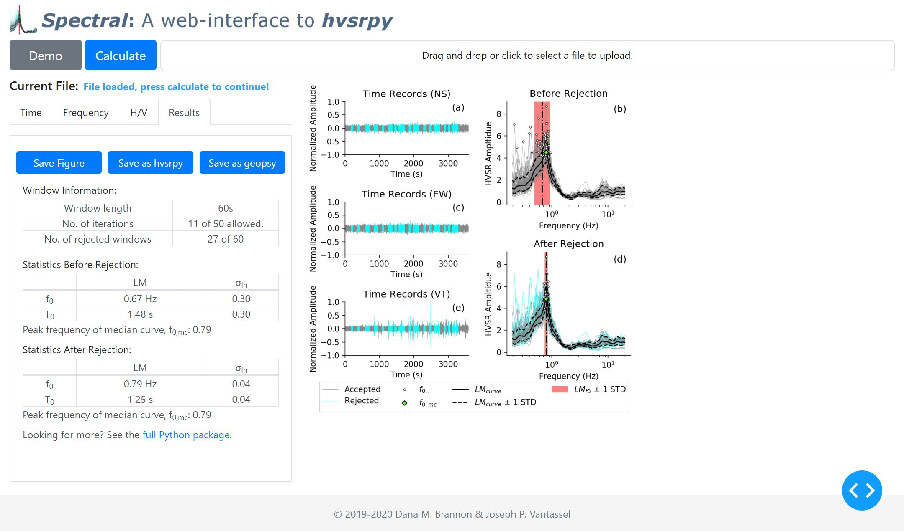

# _Spectral_ - A web application for horizontal-to-vertical spectral ratio processing

> Dana M. Brannon and Joseph P. Vantassel, The University of Texas at Austin

## Running the Application

To run the application, you can either:
- Visit the [live website](https://hvsrpy.cb-geo.com/), or
- Run locally by cloning this repository using `git clone https://github.com/dmbrannon/HVSR_app.git`. Then, install the necessary 
  requirements by running `pip install -r requirements.txt`. You can now run the command
  `python app.py` inside the project directory. Your command line/terminal should
  show a local host url that you can copy and paste into your browser to view
  the app interface.

## About _Spectral_

_Spectral_ is an open-source, web-based application for performing
horizontal-to-vertical spectral ratio (HVSR) calculations in a convenient,
reliable, and statistically-consistent manner. _Spectral_ allows the user to
upload three-component ambient noise records and perform the HVSR calculation in
the cloud, with no installation required. The calculations in this application
are performed using the Python package `hvsrpy`, which was developed by
Joseph P. Vantassel under the supervision of Professor Brady R. Cox at
The University of Texas at Austin. More information about `hvsrpy` can be found
on its [GitHub](https://github.com/jpvantassel/hvsrpy).

### Example Results

