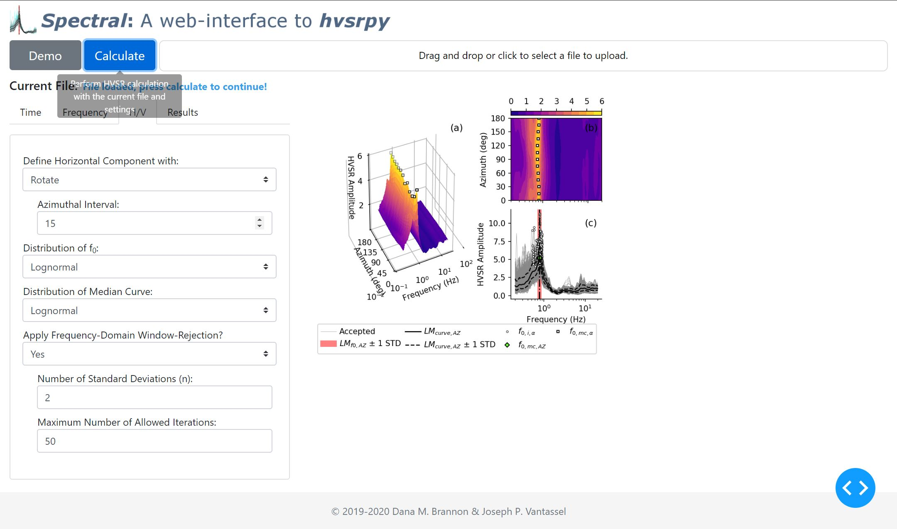

# _Spectral_ - A web application for horizontal-to-vertical spectral ratio processing

> Dana M. Brannon and Joseph P. Vantassel, The University of Texas at Austin

## Running the Application

To run the application, you can either:
- Visit the [live website](https://hvsrpy.cb-geo.com/) (_recommended_), or
- Run locally by
  - Cloning this repository using `git clone https://github.com/dmbrannon/HVSR_app.git`,
  - Installing the necessary dependencies with `pip install -r requirements.txt`,
  - Running the module with `python app.py` from inside the project directory, and
  - Accessing the specified local host url using your favorite web browser.

## About _Spectral_

_Spectral_ is an open-source, web-based application for performing
horizontal-to-vertical spectral ratio (HVSR) calculations in a convenient,
reliable, and statistically-consistent manner. _Spectral_ allows the user to
upload three-component ambient noise records and perform the HVSR calculation in
the cloud, with no installation required. For the calculation details,
_Spectral_ relies on the open-source Python package `hvsrpy` developed by
Joseph P. Vantassel under the supervision of Professor Brady R. Cox at The
University of Texas at Austin. More information about `hvsrpy` can be found
on [GitHub](https://github.com/jpvantassel/hvsrpy).

### Processing using the _geometric mean_ of the horizontal components

### Processing using the _rotated_ horizontal components

