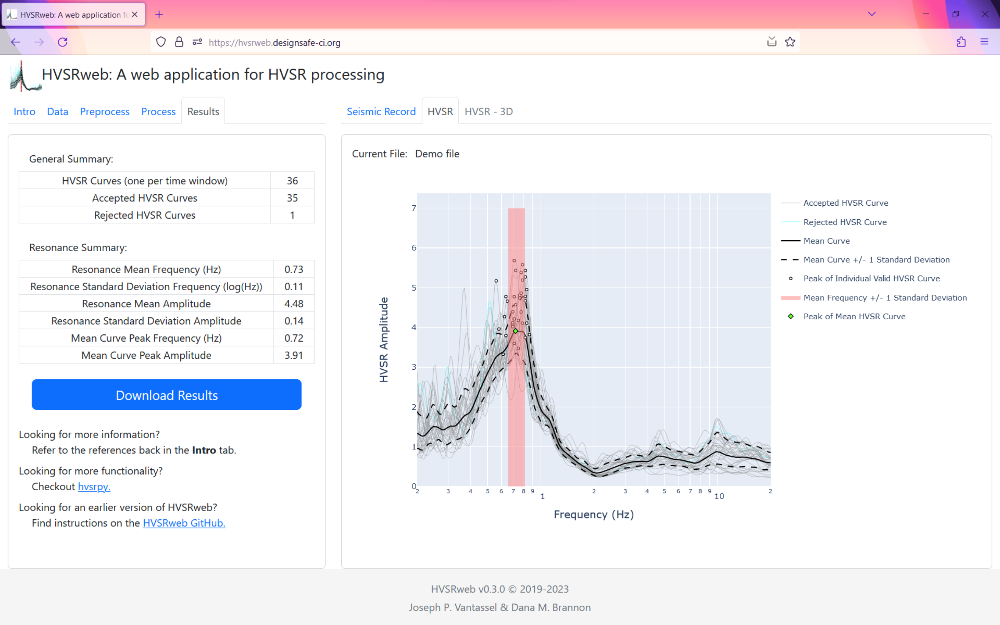

# HVSRweb - A web application for horizontal-to-vertical spectral ratio processing

> Dana M. Brannon and Joseph P. Vantassel, The University of Texas at Austin

## About HVSRweb

HVSRweb is an open-source, web-based application for performing
horizontal-to-vertical spectral ratio (HVSR) calculations in a convenient,
reliable, and statistically-consistent manner. HVSRweb allows the user to
upload three-component ambient noise records and perform the HVSR calculation in
the cloud, with no installation required. For the calculation details,
HVSRweb relies on the open-source Python package _hvsrpy_ developed by
Joseph P. Vantassel under the supervision of Professor Brady R. Cox at The
University of Texas at Austin. More information about  _hvsrpy_ can be found
on its [GitHub repository](https://github.com/jpvantassel/hvsrpy).

## Running the Application

To run the application, you can either:

- Visit the [live website](https://hvsrpy.cb-geo.com/) (_recommended_), or
- Run locally

## Running Locally

To run locally:

1. Clone the repository using `git clone https://github.com/jpvantassel/hvsrweb.git`,
2. Make sure you have a modern version of Python installed (i.e., >3.6). If you
do not, you can find detailed instructions for doing so
[here](https://jpvantassel.github.io/python3-course/#/intro/installing_python).
3. Install the required dependencies using `pip install -r requirements.txt`.
If you are unfamiliar with `pip`, you may find
[this tutorial](https://jpvantassel.github.io/python3-course/#/intro/pip)
helpful.
4. Launch the application with `python app.py` from inside the project
directory.
5. Access the localhost url (e.g., localhost:8050) using your favorite web
browser.

## Running an Earlier Version

All previously released versions of HVSRweb are available as project releases.
Previous versions of HVSRweb must be run locally (i.e., are not hosted on a
live website). To access and run a previous version:

1. Go to [releases](https://github.com/jpvantassel/hvsrweb/releases) and
download the desired release.
2. Once downloaded, move and unzip the folder's contents in any convenient
location.
3. Follow the instructions for running locally (provided above) starting
from step 2.

### Example output using the _geometric mean_ of the horizontal components

### Example output using across _multiple-azimuths_ of the horizontal components

